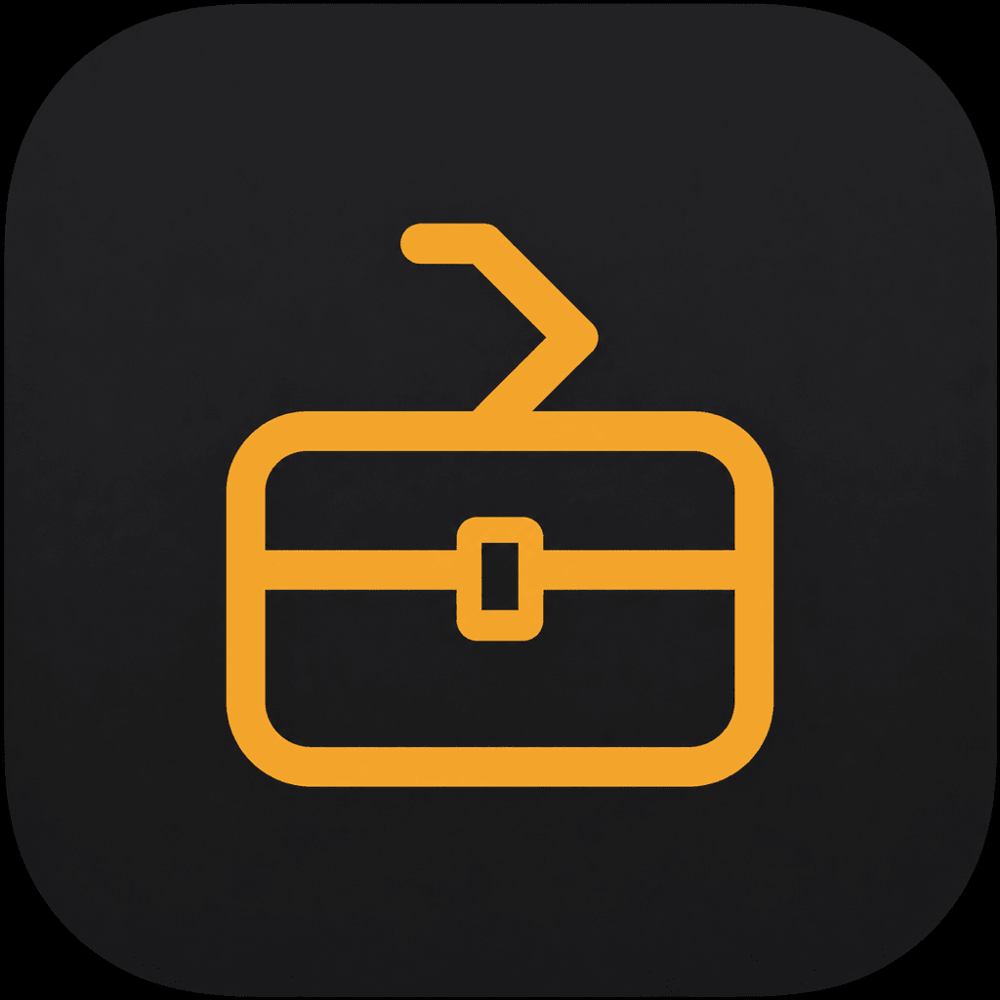
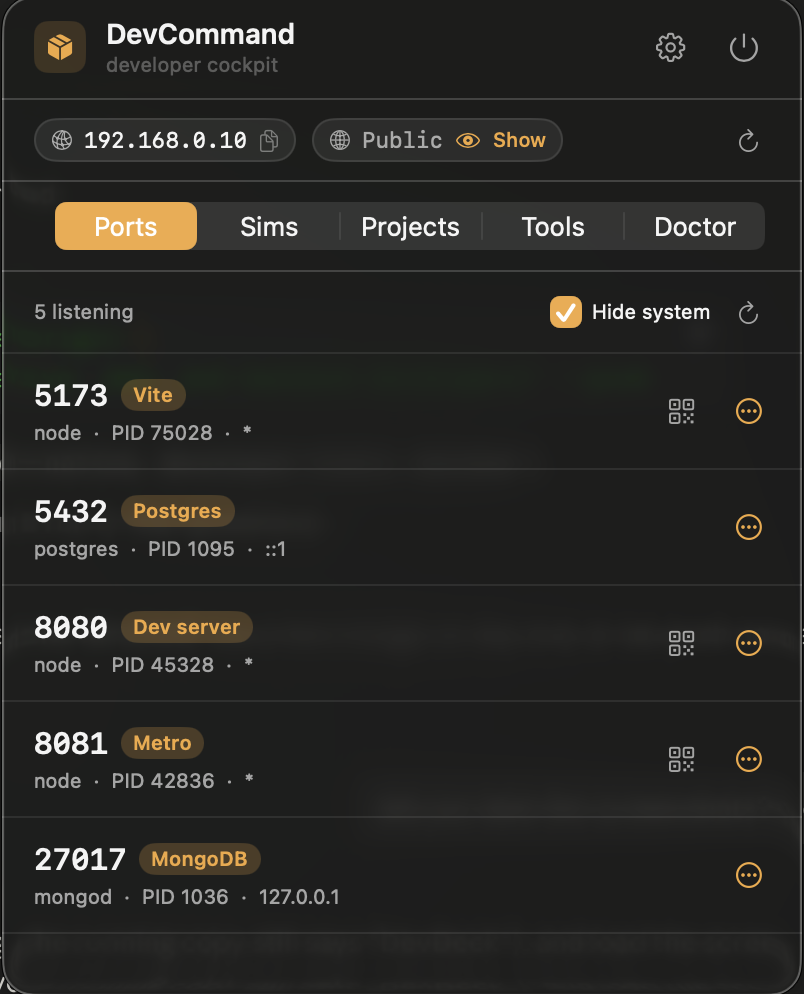

<p align="center"></p>

# DevCommand

**A tiny macOS menu-bar app for React, React Native, web, and backend developers.**

Everything you reach for during the day — open ports, simulators, dev servers, projects,
and a few handy tools — one click away in your menu bar. No Dock icon, about 1 MB, and nothing
running in the background.

[](LICENSE)


<p align="center"></p>


## Why?

A normal dev day means jumping between `lsof` to find a stuck port, `simctl` to boot a
simulator, a terminal to start Metro, and Finder to open a project. DevCommand puts all of that
one click away — and stays out of your way the rest of the time.

## What you can do

- **Ports** — see what's listening, kill a stuck port, or open/copy its URL.
- **Sims** — boot any iOS or tvOS simulator and run a project on it.
- **Projects** — your dev folder at a glance: start/stop each dev server inline (Metro / Expo /
  npm / yarn / pnpm / bun) with a live `:port` badge, run any `package.json` script, install deps,
  clean build caches, Prebuild, `pod install`, or open in Xcode / your editor / Terminal.
- **Doctor** — environment health checks, plus a **Shell** card showing which Node and version
  manager (nvm / fnm / volta / mise / asdf) your launched commands will actually use, with quick
  access to edit `~/.zshrc`.
- **Tools** — UUID, Unix timestamp, secret token, Base64, JWT decode, plus one-tap cleanups
  (clear DerivedData, reset Watchman, clean npm cache, kill node).
- **Always visible** — your LAN IP (click to copy), an optional public IP you reveal with a tap, and a
  QR button to open a dev server on your phone (an Expo/Browser toggle opens it straight in the Expo dev client).

## Install

**Download the app** (easiest): grab the signed, notarized [`.dmg` from the latest release](https://github.com/eno-dev/DevCommand/releases/latest), open it, and drag DevCommand to your Applications folder. No Apple account, no build, no Gatekeeper warning.

**Or build from source** (about 10 seconds):

```sh
git clone https://github.com/eno-dev/DevCommand.git
cd DevCommand
zsh scripts/install.sh
```

Then look for the box icon in your menu bar. Done.

## Updating & uninstalling

- **Update** — **Settings → Check for Updates** pulls the latest and rebuilds in place
  (or run `zsh scripts/update.sh`).
- **Uninstall** — **Settings → Uninstall DevCommand** moves the app to the Trash and clears its
  preferences and login item (or run `zsh scripts/uninstall.sh`).

## Using it

- **Open it** — click the menu-bar icon.
- **Switch panels** — the tabs across the top (Ports, Sims, Projects, Tools, Doctor).
- **Projects** — star a project to pin it to the top; running ones sort first, then alphabetical.
  Drag favorites to reorder.
- **Settings** — the gear icon (top right). Turn panels or tools on/off, manage your projects
  folders, editor and terminal, and enable launch-at-login.
- **Quit** — the power button (top right). It's a menu-bar app, so that's how you fully close it.

## Building & contributing

It's a plain Swift package with no dependencies — open the folder in Xcode and press ⌘R, or:

```sh
swift build     # debug build
swift run       # run from the terminal (the menu-bar icon appears)
```

See [CONTRIBUTING.md](CONTRIBUTING.md) for the project layout and conventions.

## How it stays light

No daemon, no background service, no bundled browser, no third-party libraries. Each panel just
runs a quick command (`lsof`, `xcrun simctl`, …) when you open it — and only while you're
looking at it.

## License

[MIT](LICENSE) © [Eno Saliu](https://eno-sa.netlify.app) — use it, fork it, ship it.
